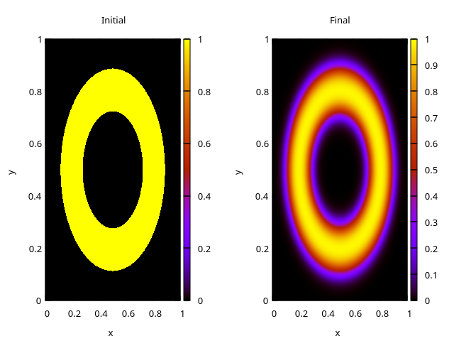

# 2D diffusion on GPU

2D diffusion code in OpenCL, tutorial project. Finite difference method using  5-point
stencil, explicit 2nd order Euler time-stepping. Adapted from
M.Öhmans(?)
[example](https://www.c3se.chalmers.se/documentation/applications/using_gpu/numba/)
for python/Numba/cuda.

# Requires

- CMake
- OpenCL
- gnuplot

# Install and run

    cmake -B build
    cd build
    make
    ./solver -d 0.1 -n 1000

Visualize with gnuplot

    cd ..
    gnuplot -p plot.gnu

For d = 0.1 and 10000 iterations, we get a result such as 

# Notes
 
- `BLOCK_SIZE` is set in `CMakeLists.txt`, controls size of work group
- Using a dynamically allocated scratch memory for local groups on GPU led
  to strange artifacts, using a fixed size (`BLOCK_SIZE` * `BLOCK_SIZE`)
  array instead.
- tested on NVIDEA 1650s: 4M grid points, 10000 iterations in ~ 5.2 seconds!
